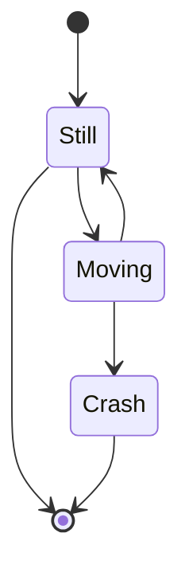
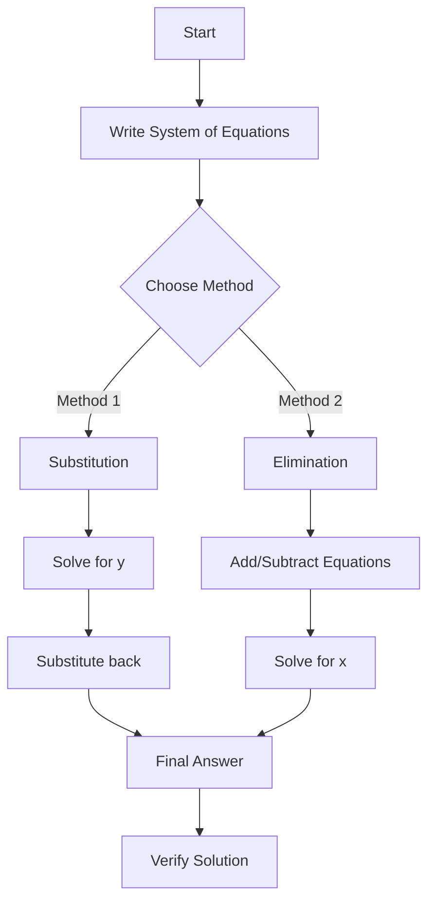
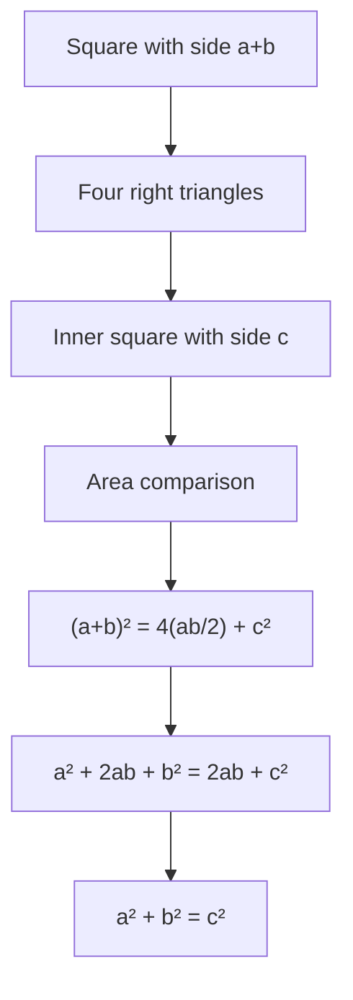

# Combined Markdown, TeX, and Mermaid Example

## 1. Mathematical Formulas

### Basic Equations
Here's a simple quadratic equation: $ax^2 + bx + c = 0$

The solutions are given by the quadratic formula:
$$x = \frac{-b \pm \sqrt{b^2 - 4ac}}{2a}$$

### Complex Mathematics
The Euler's formula states that:
$$e^{ix} = \cos(x) + i\sin(x)$$

A beautiful identity follows:
$$e^{i\pi} + 1 = 0$$

## 2. Flow Diagrams

### Simple Flow

### State Machine

## 3. Combined Example: Math Problem Solving

### Problem Statement
Let's solve a system of equations:
$$\begin{cases}
2x + y = 5 \\
x - y = 1
\end{cases}$$

### Solution Process

### Solution
The solution is:
$$x = 2, \quad y = 1$$

## 4. Sequence Diagram Example

## 5. Mathematical Proof with Diagram

### Theorem
For any right triangle with sides $a$, $b$, and hypotenuse $c$:
$$a^2 + b^2 = c^2$$

### Visual Proof

### Algebraic Proof
Starting with the equation:
$$(a+b)^2 = 4\cdot\frac{ab}{2} + c^2$$

Expanding the left side:
$$a^2 + 2ab + b^2 = 2ab + c^2$$

Subtracting $2ab$ from both sides:
$$a^2 + b^2 = c^2 \quad \blacksquare$$
